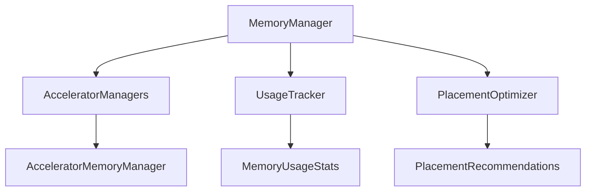
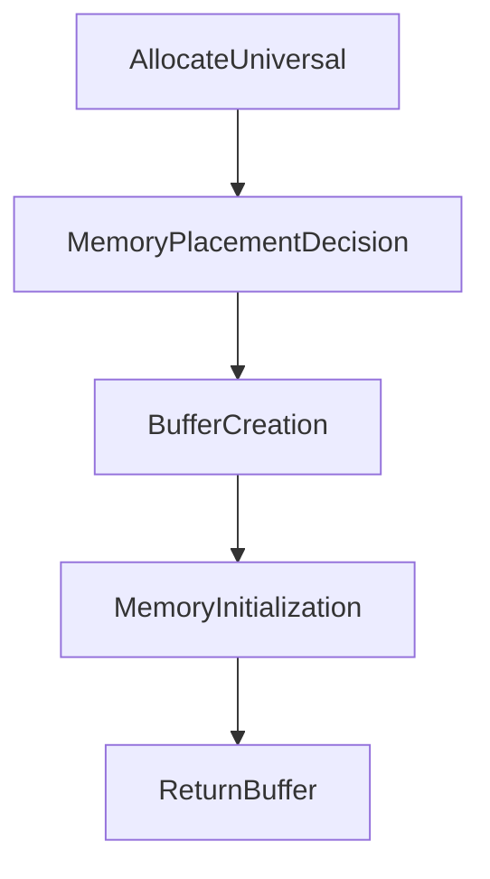

# Memory Management

UniversalCompute provides a sophisticated memory management system designed to optimize performance across diverse hardware accelerators. The `UniversalMemoryManager` class serves as the central controller for memory allocation, placement, and optimization.

## Table of Contents

1. [Overview](#overview)
2. [Key Components](#key-components)
3. [Memory Placement Strategies](#memory-placement-strategies)
4. [Key Methods](#key-methods)
5. [Usage Examples](#usage-examples)
6. [Best Practices](#best-practices)
7. [Limitations](#limitations)

## Overview

The memory management system in UniversalCompute is designed to handle memory resources across all connected accelerators, including CPUs, GPUs, NPUs, and other hardware accelerators. The `UniversalMemoryManager` class is the primary interface for managing memory resources, providing features such as:

- Automatic memory placement optimization
- Memory usage tracking and optimization
- Cross-platform compatibility
- Performance monitoring

## Key Components

### `UniversalMemoryManager`

The `UniversalMemoryManager` class manages memory resources across all connected accelerators. Its primary responsibilities include:

1. **Memory Allocation**: Dynamically allocates memory based on hardware capabilities and workload requirements.
2. **Placement Optimization**: Automatically places memory buffers in optimal locations (CPU, GPU, NPU, etc.) based on access patterns and performance needs.
3. **Usage Tracking**: Monitors memory usage patterns to recommend optimal placement strategies for future allocations.
4. **Cleanup and Optimization**: Periodically cleans up unused memory and optimizes memory layout for improved performance.

### Memory Usage Tracker

The memory usage tracker provides insights into memory consumption across all accelerators, enabling users to:

- Monitor memory usage patterns
- Identify memory leaks
- Optimize memory usage
- Generate memory usage reports

### Memory Placement Optimizer

The memory placement optimizer analyzes memory access patterns and hardware capabilities to recommend optimal memory placements. It supports the following placement strategies:

- **Auto Placement**: Automatically determines the optimal placement based on buffer size and access patterns.
- **Host-Pinned**: Keeps memory locked in CPU RAM for fast access.
- **Device Local**: Places memory directly on the GPU or accelerator device.
- **ReadOnly Optimized**: Optimizes memory layout for read-only operations.

## Memory Placement Decision Table

| Use Case                          | Recommended Placement       | Notes                                                                 |
|-----------------------------------|-----------------------------|-----------------------------------------------------------------------|
| Small Buffers (<64KB)            | Host-Pinned                 | Ideal for frequent CPU access                                           |
| Medium Buffers (64KB-16MB)       | Device Local                | Balances GPU access and reduced CPU-GPU transfer overhead             |
| Large Buffers (>16MB)             | Device Local or Auto        | Depends on access pattern and hardware support                         |
| Read-Only Data                   | ReadOnly Optimized          | Optimized for scenarios where data is read but not modified             |
| Frequently Accessed Data          | Auto or Host-Pinned         | Let the system decide based on access patterns                          |

## Key Methods

### `AllocateUniversal<T>`

```csharp
public IUniversalBuffer<T> AllocateUniversal<T>(
    long size,
    MemoryPlacement placement = MemoryPlacement.Auto,
    MemoryAccessPattern accessPattern = MemoryAccessPattern.Unknown)
    where T : unmanaged
```

Allocates a universal buffer with automatic memory placement optimization. The system intelligently selects the optimal memory placement based on:

- Buffer size
- Access pattern
- Current memory usage
- Hardware capabilities

**Example:**

```csharp
var context = new Context();
var memoryManager = new UniversalMemoryManager(context);
var buffer = memoryManager.AllocateUniversal<float>(1024, MemoryPlacement.Auto);
```

### `AllocateUniversal<T> (ReadOnlySpan<T> data)`

```csharp
public IUniversalBuffer<T> AllocateUniversal<T>(
    ReadOnlySpan<T> data,
    MemoryPlacement placement = MemoryPlacement.Auto,
    MemoryAccessPattern accessPattern = MemoryAccessPattern.Unknown)
    where T : unmanaged
```

Allocates a universal buffer and initializes it with provided data. This method is useful for creating buffers from existing data sources.

**Example:**

```csharp
var data = new float[] { 1.0f, 2.0f, 3.0f, ... };
var buffer = memoryManager.AllocateUniversal(data, MemoryPlacement.Auto);
```

### `FromMemoryBuffer<T>`

```csharp
public IUniversalBuffer<T> FromMemoryBuffer<T>(
    MemoryBuffer1D<T, Stride1D.Dense> memoryBuffer,
    bool takeOwnership = false)
    where T : unmanaged
```

Creates a universal buffer from an existing memory buffer. This method is useful for integrating with existing memory management systems.

**Example:**

```csharp
var existingBuffer = ...; // Create or obtain existing memory buffer
var universalBuffer = memoryManager.FromMemoryBuffer(existingBuffer, takeOwnership: true);
```

## Usage Examples

### Basic Memory Allocation

```csharp
var context = new Context();
var memoryManager = new UniversalMemoryManager(context);
var buffer = memoryManager.AllocateUniversal<float>(1024, MemoryPlacement.Auto);
```

### Optimized Memory Allocation

```csharp
var recommendations = memoryManager.GetPlacementRecommendations();
var buffer = memoryManager.AllocateUniversal<int>(1024 * 1024, recommendations.MediumBuffers);
```

### Memory Cleanup

```csharp
memoryManager.Cleanup();
```

## Best Practices

1. **Use Auto Placement**: Let the system automatically determine the optimal memory placement for your buffers.
2. **Monitor Memory Usage**: Use the `GlobalMemoryStats` property to monitor memory usage across all accelerators.
3. **Periodic Cleanup**: Call `Cleanup()` periodically to reclaim unused memory.
4. **Optimize Buffers**: Use `GetPlacementRecommendations()` to optimize memory placement for specific workloads.
5. **Avoid Manual Memory Management**: Let the `UniversalMemoryManager` handle memory allocation and deallocation to minimize the risk of memory leaks.

### Practical Example: Optimizing Neural Network Training

```csharp
// Create memory manager
var context = new Context();
var memoryManager = new UniversalMemoryManager(context);

// Allocate optimized memory for model weights
var weights = memoryManager.AllocateUniversal<float>(1024 * 1024, 
    placement: MemoryPlacement.DeviceLocal,
    accessPattern: MemoryAccessPattern.ReadWrite);

// Allocate host-pinned memory for input data
var inputBuffer = memoryManager.AllocateUniversal<float>(batchSize,
    placement: MemoryPlacement.HostPinned);

// Training loop
for (int epoch = 0; epoch < numEpochs; epoch++)
{
    // Update model weights
    weights.Update(data);
    
    // Cleanup unused memory
    if (epoch % 10 == 0)
        memoryManager.Cleanup();
}
```

## Limitations

- **Hardware Support**: Currently supports a limited set of hardware accelerators
- **Memory Migration**: Memory migration between accelerators is not yet implemented
- **Performance Variability**: Performance may vary based on hardware capabilities
- **Advanced Features**: Advanced memory optimization features are still experimental

## Diagrams

### Memory Manager Architecture



### Memory Allocation Flow



## Next Steps

- [Implementation Guide](../Implementation-Guide.md)
- [API Reference](../API-Reference.md)